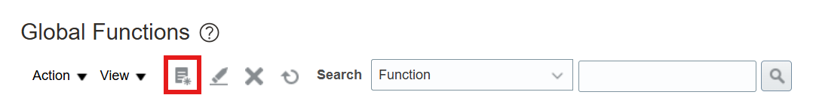
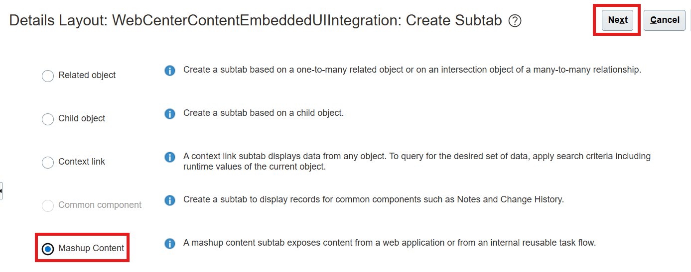

# Extend Business Object To Get Managed Attachments Page And Embed In Module

## Introduction

In this lab we will extend business object to call Grant WebService, get managed attachments page and embed in a module

**Estimated Lab Time**: *45 minutes*

### Objectives

In this lab, you will

- Create a Global Function to Call WebCenter Content Grant WebService
- Create a Mashup To Embed Managed Attachments Page
- Extend Specific Business Object To Show Managed Attachments Page

### Prerequisites

This lab assumes you have:

- A Paid or LiveLabs Oracle Cloud account
- Access to an Oracle Fusion Applications instance
- All previous labs successfully completed

## Task 1: Create a Global Function to Call WebCenter Content Grant WebService

1. Sign in to Oracle Fusion Apps as an administrator.

2. Click **Tools**, **Application Composer**.  

   

3. Choose **Common Setup** and then **Global Functions** from the left navigation menu.

   

4. On the Global Functions page, click the **Add a Global Function** button icon.

   

5. On the Create Global Function page in the **Function Name** field, specify a name for eg  **WebCenterContentGrantWebserviceFunction**.

6. Select **String** from the **Returns** drop-down menu.

7. In the Parameters section, click the **Add Parameter** icon and add the following fields:

   a. Name - SrNumber

   b. Type - String

8. Download the [Grant Webservice](files/grant-ws.groovy) groovy code.

9. In the **Edit Script** field, paste the contents of the downloaded script:

   **Note**:
   For **applicationName**, enter a name for your Sales cloud instance. For example, **`<MyCompany>SalesCloud`**.

10. Click **Validate** and then **Save and Close**.

    

About Grant webservice payload:

You can specify up to 5 keys (businessObjectKey1 ... businessObjectKey5) and their corresponding values (businessObjectValue1 ... businessObjectValue5) respectively in the payload. The maximum character lengths of various parameters are:

- applicationName: 20
- businessObjectType: 100
- businessObjectKey's: 80
- businessObjectValue's: 80

These variables should form a unique combination to attach the documents. They should be provided the same values consistently for a given object record so that previously attached documents (if any) are retrieved using the same combination of values.

## Task 2: Create a Mashup To Embed Managed Attachments Page

A Mashup is a window into an independent external application such as WebCenter Content. To create a Mashup to embed the WebCenter Content embedded user interface (so that it can be exposed in an Oracle Sales and Service business object):

1. Choose **Common Setup** and **Mashup Content** from the left navigation menu.

   

2. On the Mashup Content: Web Applications page, click **Register Web Application**.

   

3. On the Register Web Application page, complete the following fields:

   a.  In the **Name** field, specify **WebCenterContentManagedAttachmentsUIMashup** as the name of the application.

   b.  For the **Type** field, select the **Groovy Expression** option.

   c.  In the **URL Definition** field, enter below snippet as the WebCenter Content embedded UI URL.

       ```text
       <copy>
       https://<WebCenter Content Server Host>:<WebCenter Content Server Port>/cs/idcplg?IdcService=EMBEDLOGIN_HOME&ActAsAnonymous=true
       </copy>
       ```

4. Click **Save and Close**.

   

## Task 3: Extend Specific Business Object To Show Managed Attachments Page

Business objects can be extended using a Mashup to expose an external application such as WebCenter Content within the Business Object user interface. To create a new service request page layout to include the WebCenter Content integration:

1. Choose **Objects**, then **Standard Objects**, then **Service Request**, and then **Pages** from the left navigation menu.

   

   

2. On the **Service Request:** Pages page, in the **Details Page Layouts** section, select **Standard Layout** row and click the **Duplicate Details Page Layout** button.

   

3. In the Duplicate Layout dialog, complete the following fields:

   a.  In the **New Layout Name** field, specify **WebCenterContentEmbeddedUIIntegration** as the name.

   b.  In the **Source Layout** field, select **Standard layout** from the drop-down menu.

   c.  Click **Save and Edit**.

   

4. In the Details Layout page, select the **Add** icon from the bottom of the left navigation menu in the Subtabs Region section to add the WebCenter Content embedded UI.

   

5. Select the **Mashup Content** option. Click **Next**.

   

6. On the next page, select the **WebCenterContentManagedAttachmentsUIMashup** option that was created earlier and click **Insert**.

   

7. On the next page, complete the following fields:

   a.  In the **Display Label** field, enter **Managed Attachments**.

   b.  For the **Display Icon**, click **Change Icon** if you want to change the default icon that shows up in the service request UI as a tab.

   c.  In the **Edit Script** field, paste the following script:

       ```groovy
       <copy>
       println("Service Request Managed Attachments Tab Selected: " + SrNumber);

       // Create MA url based off the item SrNumber
       def ucmMaUrl = adf.util.WebCenterContentGrantWebserviceFunction(SrNumber);

       println("WebCenter Content MA Url suffix " + ucmMaUrl);

       return ucmMaUrl;
       </copy>
       ```

   d.  Click **Next**.

   

   e.  Click **Save and Close**.

   

## Acknowledgements

- **Authors-** Ratheesh Pai, Senior Principal Member Technical Staff, Oracle WebCenter Content
- **Contributors-** Ratheesh Pai, Rajiv Malhotra, Vinay Kumar
- **Last Updated By/Date-** Ratheesh Pai, July 2025
