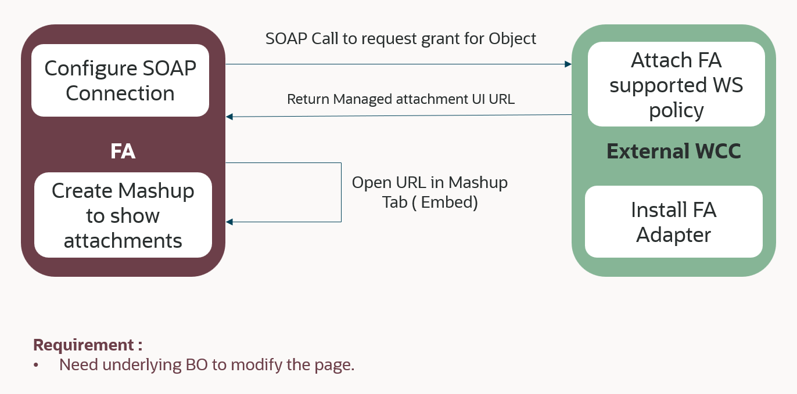

# Introduction

Learn how to extend Oracle Fusion Applications by adding Managed Attachments using Application Composer based Standard Business Objects

## About this Workshop

Organizations have requirements to attach supporting documents to specific records to various modules in Oracle Fusion Apps. This lab would help set it up with **Service** - **Service Requests** module as an example.

*Estimated Time:* 1 hour 45 min

### **About extending Oracle Fusion Applications by adding Managed Attachments using Application Composer based Standard Business Objects**

The objective of this lab is to implement the ability to add attachments respective to a given record in **Service** - **Service Requests** module as an example. A standard business object associated with the module makes a SOAP call to WebCenter Content Grant webservices to get a URL with unique managed attachment GUID. This managed attachments page is inserted as a mashup in the module's page. The managed attachments page section is then used for attaching documents specific to the record.

### **Objectives**

In this lab, you will:

* Configure WebCenter Content for Fusion Apps Integration
* Use Application Composer to Insert Managed Attachments Page as a Mashup in Fusion Applications Page
* Publish the application and use it

### **Prerequisites**

This lab assumes you have:

* Paid or LiveLabs Oracle Cloud account, to provision WCC Marketplace instance
* WCC Marketplace instance with HTTPS enabled Content Server URL
* Access to an Oracle Fusion Applications instance.

You may now **proceed to the next lab**.

### **Learn More**

* [Introduction To WebCenter Content](https://docs.oracle.com/en/middleware/webcenter/content/12.2.1.4/index.html)

## Acknowledgements

* **Authors-** Ratheesh Pai, Senior Principal Member Technical Staff, Oracle WebCenter Content
* **Contributors-** Ratheesh Pai, Rajiv Malhotra, Vinay Kumar
* **Last Updated By/Date-** Ratheesh Pai, July 2025
