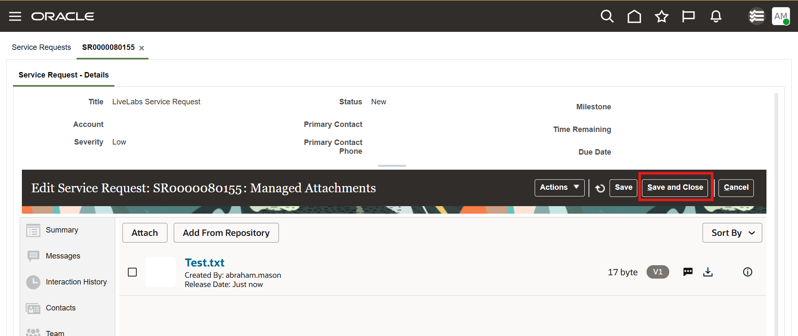

# Verify Changes In Sandbox, Publish And Use The Integration

## Introduction

In this lab we will verify changes in sandbox, publish it and use the integration.

**Estimated Lab Time**: *30 minutes*

### Objectives

In this lab, you will

- Verify the Integration in the Sandbox
- Publish the Sandbox and Use the Integration

### Prerequisites

This lab assumes you have:

- A Paid or LiveLabs Oracle Cloud account
- WCC Marketplace instance with HTTPS enabled Content Server URL
- Access to an Oracle Fusion Applications instance
- All previous labs successfully completed

## Task 1: Verify the Integration in the Sandbox

1. Sign in to Oracle Fusion Apps as an administrator.

2. Click navigation menu and **Service**, **Service Request**

   

   

3. On the Service Requests page, click **Create Service Request**.

4. On the Create Service Request page, complete the following fields for the service request:

    a.  In the **Title** field, enter the service request name (for example, **LiveLabs Service Request**).

    b.  Click **Save and Continue**.

   

5. Click the **Managed Attachments** tab to load the attached assets in the WebCenter Content embedded user interface.

    **Note**: Sign in as the same user used in the Oracle Sales and Service application (these users must match between systems). If you are using Chrome in Incognito mode, you must allow cookies. If not already logged in to WebCenter Content, you must allow pop-ups for the log-in window to appear.

6. Click **Attach**.

   

7. In **Document Upload** dialog click **+** button to open file chooser dialog. Select a file from file system and click **Upload** and wait for upload to finish.

   

8. Click **Close** button to close the dialog.

   

9. The document is now attached to the service request. Click **Save and Close** button to close the service request creation page.

   

## Task 2: Publish the Sandbox and use the Integration

1. Login to Fusion Apps as administrator

2. Select the name of your sandbox in the upper left corner of the page (for example, 'WebCenter Content Managed Attachments Integration') and then select the **Sandbox Details** option from the drop-down menu.

   

3. On the Sandbox Details page, click **Publish** to publish the sandbox.

   

4. In the warning message box, click **Yes** if you’re certain that the integration is working as expected and you’re ready to make these changes permanent (and public).

In this environment SSO is not configured. So for managed attachments you need to use the same username as in Fusion Apps to login to WebCenter Content.

Organizations can now easily access, view, and upload assets associated with a **Service**, **Service Requests** module directly from the **Managed Attachments** tab with all material stored within Oracle WebCenter Content. The Oracle WebCenter Content Managed Attachment UI provides an easy and modern interface for contributing and storing content.

## Acknowledgements

- **Authors-** Ratheesh Pai, Senior Principal Member Technical Staff, Oracle WebCenter Content
- **Contributors-** Ratheesh Pai, Rajiv Malhotra, Vinay Kumar
- **Last Updated By/Date-** Ratheesh Pai, July 2025
