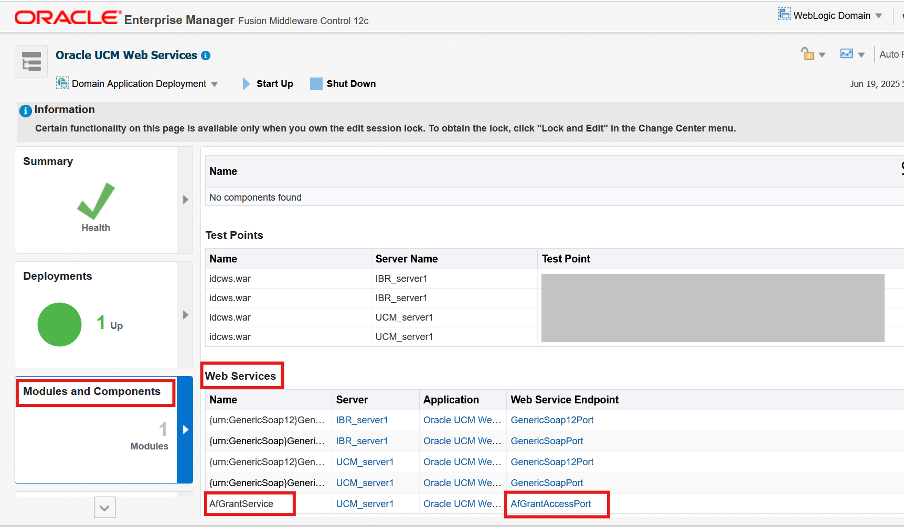
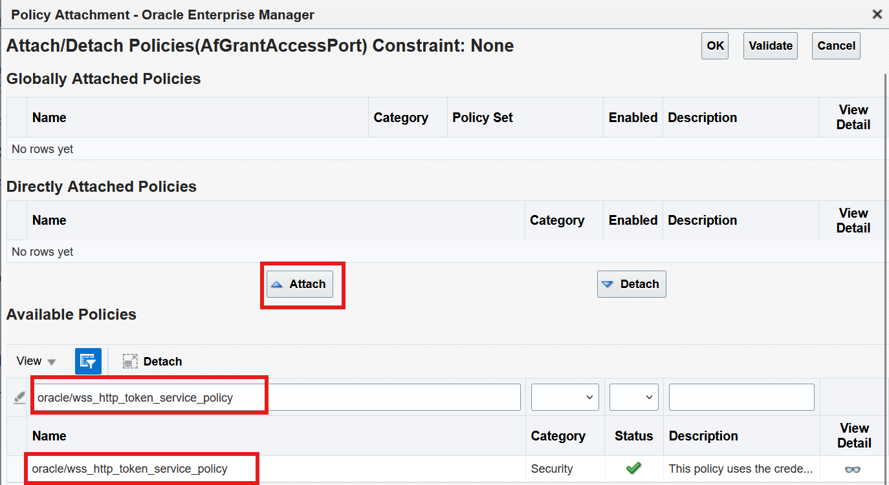

# Configure WebCenter Content for FA Integration

## Introduction

In this lab, we will configure WebCenter Content for Fusion Apps Integration

**Estimated Lab Time**: *45 minutes*

### Objectives

In this lab, you will

- Set Up DNS and SSL Certificate for WebCenter
- Run configuration script which automatically configures most of WebCenter Content managed attachments settings
- Enable Advanced Security in WebCenter Content
- Enable Webservice Security Policy for WebCenter Content Grant Webservice

### Prerequisites

This lab assumes you have:

- A Paid or LiveLabs Oracle Cloud account
- SSL certificate bundle file, root CA certificate file and certificate private key from registrar or SSL provider
- All previous labs successfully completed

## Task 1: Set Up DNS and SSL Certificate for WebCenter

This is needed for the SOAP webservice call from Fusion Apps to WebCenter Content to succeed.

1. Log in to OCI console.

2. Click the profile picture icon (profile) on the top right, and then click **User Settings** which will take you to your user details page.

   

3. Click **Tokens and Keys**, and then click on the ellipsis '**...**' on the api key row, **View Configuration File** and click **Copy** and paste into a file.

4. Click **Close**.

   

   

5. Log in to **wls-1 of WebCenter Content stack VMs** and change to oracle user

   ```bash
   <copy>
   sudo su - oracle
   </copy>
   ```

6. Create a temporary directory `/u01/certs` and copy or download your SSL certificate for the host at this location. You might have a wild card certificate from your registrar or your SSL provider. For example, if you want to use host `wcc1.mycompany.com` to map to the load balancer, you may have a wild card certificate for `*.mycompany.com`. You might get a certificate file, a CA cert, and a private key for the SSL certificate. Copy everything to this location.

7. Copy the ssh private key file from 'Lab 1 - Prepare Setup' to this location and name it **oci_user_pvt.key**.

8. Put the configuration file from step 3 in this location and update the property **key_file** to point to this private key file.

   `key_file=/u01/certs/oci_user_pvt.key`

9. The certificate file needs to be in a single concatenated pem file with host certificate at the top followed by intermediate certificate.

   ```bash
   <copy>
   cat ssl_certificate.crt IntermediateCA.crt >> certbundle.pem
   </copy>
   ```

10. Execute `dns_and_cert_manager.sh` script to install the load balancer certificate and create the DNS record.

    ```text
    sh dns_and_cert_manager.sh
       -c : Certificate bundle file  [REQUIRED]
       -a : Root CA certificate file [OPTIONAL]
       -k : Certificate private key if available [OPTIONAL]
       -p : Certificate private key password if applicable [OPTIONAL]
       -z : DNS zone name [REQUIRED]
       -d : Fully qualified domain name [REQUIRED]
       -f : DNS oci user config file with API key [REQUIRED]
       -t : Type of operation, it can be either DNS or CERT [OPTIONAL]
    ```

    ```bash
    <copy>
    # Go to scripts sh folder
    cd /u01/scripts/lcm/sh

    # Install load balancer certificate as well as create DNS record. Skip -t option to do both.
    sh dns_and_cert_manager.sh -c /u01/certs/certbundle.pem -a /u01/certs/root_ca.pem -k /u01/certs/private.key -z mycompany.com -d wcc1.mycompany.com -f /u01/certs/config
    </copy>
    ```

    **Note**: It will create the DNS record but it might take a couple of hours before the host URL can be used.

11. The script will output the nameserver hosts corresponding to the DNS record. To register the external domain, you will need to add the nameserver hosts to your domain registrar.

    Example:

    ```text
    ns1.p201.dns.oraclecloud.net
    ns2.p201.dns.oraclecloud.net
    ```

12. Log in to your registrar (for example: namecheap, godaddy, etc.) where your external domain is registered. Navigate to your domain management option and add the nameservers that you copied in the previous step as custom DNS for your domain. You may need to go through their documentation or contact your registrar in case you cannot find this configuration.

13. Log in to **wls-1 of WebCenter Content stack VMs** and update the service host to new value

```bash
<copy>
sudo su - oracle
cd /u01/scripts/lcm/sh
nohup sh update_service_host.sh -s <wcc1.mycompany.com> &
</copy>
```

The logs can be monitored using command for it to finish.

```bash
<copy>
tail -f /u01/data/domains/logs/provisioning.log
</copy>
```

## Task 2: Run script to configure WebCenter Content for managed attachments

Log in to **wls-1 of WebCenter Content stack VMs** and run the following commands to configure it for FA integration.

1. Change to oracle user

 ```bash
<copy>
sudo su - oracle
</copy>
 ```

2.For existing stacks after patching (This will have latest scripts and should be used as preferred location)

```bash
<copy>
cd /u01/scripts/patch/lcm/sh
</copy>
```

For new stacks (If in case `configure_wcc_fa_adapter.sh` script is not found on above path)

 ```bash
<copy>
cd /u01/scripts/lcm/sh
</copy>
 ```

Run the configuration script with the following arguments. Since this lab environment is not configured with IDCS we do not need to provide SSO credentials option in the command line. 

```bash
<copy>
sh configure_wcc_fa_adapter.sh --fa_domain <fa-domain-host> --ucm_domain <ucm domain host>
</copy>
```

## Task 3: Enable Advanced Security in WebCenter Content

1. Log in to WebCenter Content as an administrator.

2. Navigate to **Administration** and then to **Configuration for wcc\*\*\*\***.

3. On the Configuration Information page, make a note of the value for the search engine under the System Configuration section.

    

4. Under **Administration**, click **Oracle Advanced Security Configurations**.

5. On the Oracle Advanced Security Configurations page, complete the following updates:

    If WebCenter Content is set to use `DATABASE.METADATA` as the search engine:

    a.  Select the **Core QueryText Security Config** check box.

    b.  Custom table names: **AFOBJECTS**

    c.  Custom field names: Leave this field blank.

    d.  Click **Update**.

    If WebCenter Content is set to use `DATABASE.FULLTEXT` or `OracleTextSearch` as the search engine:

    a.  Select the **Core QueryText Security Config** check box.

    b.  Custom table names: **AFOBJECTS**

    c.  Custom field names: **dreleasestate**

    d.  Click **Update**.

    If custom metadata is used with `DATABASE.METADATA`:

    a.  Select the **Core QueryText Security Config** check box.

    b.  Custom table names: Leave this field blank.

    c.  Custom field names: \<xCustomMetadataField1; xCustomMetadataField2; xCustomMetadataField3;\...\>

    d.  Click **Update**.

    If custom metadata is used with `DATABASE.FULLTEXT` or `OracleTextSearch`:

    a.  Select the **Core QueryText Security Config** check box.

    b.  Custom table names: Leave this field blank.

    c.  Custom field names: \<xCustomMetadataField1; xCustomMetadataField2; xCustomMetadataField3;\...\>

    d.  Click **Update**.

    

## Task 4: Enable Webservice Security Policy for WebCenter Content Grant Webservice

In case the required policy is already applied, skip this section.

1. Log in to Enterprise Manager as an administrator.

2. Navigate to **UCM_Server1**, **Deployments**, **Oracle UCM Webservices**, **Modules and Components**, **Webservices**, **AfGrantService**, and then to **AfGrantAccessPort**.
    

    

    

3. Click **Attach/Detach policies**.

   

4. Click **Directly Attached Policies** and then click **Attach/Detach**.

   

5. In the **Available Policies** section, search for `oracle/wss_http_token_service_policy`, select row of the search result and click **Attach**

   

6. Click **Validate** and then click **Ok**.

   

7. Restart all WebCenter Content servers using the steps mentioned in **Appendix 1: Restart WebCenter Content Server Instances**

## Appendix 1: Restart WebCenter Content Server Instances

1. Login to the WebCenter Content Weblogic console as administrator user.

2. Navigate to **Environment** > **Servers** > **Control** tab and select the checkbox for **UCM Server**(s).

3. click on **Shutdown** > **Force Shutdown**.

4. After the Server changes to **SHUTDOWN** state, select the checkbox for **UCM Server**(s), click on **Start** button.

## Acknowledgements

- **Authors-** Ratheesh Pai, Senior Principal Member Technical Staff, Oracle WebCenter Content
- **Contributors-** Ratheesh Pai, Rajiv Malhotra, Vinay Kumar
- **Last Updated By/Date-** Ratheesh Pai, June 2025
