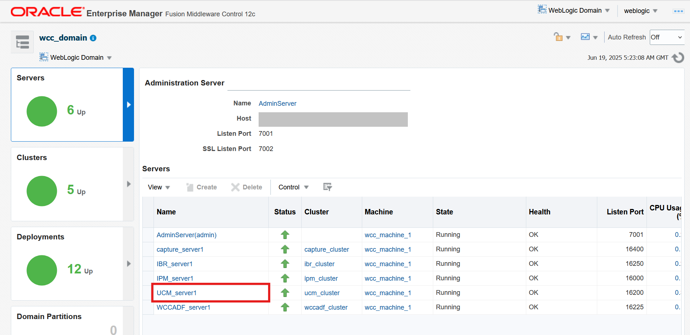

# Configure WebCenter Content for FA Integration

## Introduction

In this lab, we will configure WebCenter Content for Fusion Apps Integration

**Estimated Lab Time**: *45 minutes*

### Objectives

In this lab, you will

- Run configuration script which automatically configures most of WebCenter Content managed attachments settings
- Enable Advanced Security in WebCenter Content
- Enable Webservice Security Policy for WebCenter Content Grant Webservice

### Prerequisites

This lab assumes you have:

- A Paid or LiveLabs Oracle Cloud account
- WCC Marketplace instance with HTTPS enabled Content Server URL
- All previous labs successfully completed

## Task 1: Run script to configure WebCenter Content for managed attachments

Log in to **wls-1 of WebCenter Content stack VMs** and run the following commands to configure it for FA integration.

1. Change to oracle user

 ```bash
<copy>
sudo su - oracle
</copy>
 ```

2.For existing stacks after patching (This will have latest scripts and should be used as preferred location)

```bash
<copy>
cd /u01/scripts/patch/lcm/sh
</copy>
```

For new stacks (If in case `configure_wcc_fa_adapter.sh` script is not found on above path)

 ```bash
<copy>
cd /u01/scripts/lcm/sh
</copy>
 ```

### For IDCS SSO-based environments

Run the configuration script with the following arguments.

```bash
<copy>
sh configure_wcc_fa_adapter.sh --fa_domain <fa-domain-host> --ucm_domain <ucm domain host> --idcs_user <WCC Idcs Administrator user>
</copy>
```

When the script prompts for password input as shown below, enter the administrator password for WebCenter Content IDCS:

```
Please provide IDCS User's Password: 
```

### For non-IDCS SSO environments

Run the configuration script with the following arguments.

```bash
<copy>
sh configure_wcc_fa_adapter.sh --fa_domain <fa-domain-host> --ucm_domain <ucm domain host>
</copy>
```

## Task 2: Enable Advanced Security in WebCenter Content

1. Log in to WebCenter Content as an administrator.

2. Navigate to **Administration** and then to **Configuration for wcc\*\*\*\***.

3. On the Configuration Information page, make a note of the value for the search engine under the System Configuration section.

    

4. Under **Administration**, click **Oracle Advanced Security Configurations**.

5. On the Oracle Advanced Security Configurations page, complete the following updates:

    If WebCenter Content is set to use `DATABASE.METADATA` as the search engine:

    a.  Select the **Core QueryText Security Config** check box.

    b.  Custom table names: **AFOBJECTS**

    c.  Custom field names: Leave this field blank.

    d.  Click **Update**.

    If WebCenter Content is set to use `DATABASE.FULLTEXT` or `OracleTextSearch` as the search engine:

    a.  Select the **Core QueryText Security Config** check box.

    b.  Custom table names: **AFOBJECTS**

    c.  Custom field names: **dreleasestate**

    d.  Click **Update**.

    If custom metadata is used with `DATABASE.METADATA`:

    a.  Select the **Core QueryText Security Config** check box.

    b.  Custom table names: Leave this field blank.

    c.  Custom field names: `<xCustomMetadataField1; xCustomMetadataField2; xCustomMetadataField3;...>`

    d.  Click **Update**.

    If custom metadata is used with `DATABASE.FULLTEXT` or `OracleTextSearch`:

    a.  Select the **Core QueryText Security Config** check box.

    b.  Custom table names: Leave this field blank.

    c.  Custom field names: `<xCustomMetadataField1; xCustomMetadataField2; xCustomMetadataField3;...>`

    d.  Click **Update**.

    

## Task 3: Enable Webservice Security Policy for WebCenter Content Grant Webservice

In case the required policy is already applied, skip this section.

1. Log in to Enterprise Manager as an administrator.

2. Navigate to **UCM_Server1**, **Deployments**, **Oracle UCM Webservices**, **Modules and Components**, **Webservices**, **AfGrantService**, and then to **AfGrantAccessPort**.
    

    

    

3. Click **Attach/Detach policies**.

   

4. Click **Directly Attached Policies** and then click **Attach/Detach**.

   

5. In the **Available Policies** section, search for `oracle/wss_http_token_service_policy`, select row of the search result and click **Attach**

   

6. Click **Validate** and then click **Ok**.

   

7. Restart all WebCenter Content servers using the steps mentioned in **Appendix 1: Restart WebCenter Content Server Instances**

## Appendix 1: Restart WebCenter Content Server Instances

1. Login to the WebCenter Content Weblogic console as administrator user.

2. Navigate to **Environment** > **Servers** > **Control** tab and select the checkbox for **UCM Server**(s).

3. click on **Shutdown** > **Force Shutdown**.

4. After the Server changes to **SHUTDOWN** state, select the checkbox for **UCM Server**(s), click on **Start** button.

## Acknowledgements

- **Authors-** Ratheesh Pai, Senior Principal Member Technical Staff, Oracle WebCenter Content
- **Contributors-** Ratheesh Pai, Rajiv Malhotra, Vinay Kumar
- **Last Updated By/Date-** Ratheesh Pai, June 2025
