# Create VBCS-Based Application Extension

## Introduction

In this lab we will create a VBCS-Based application extension to call the custom object based webservice and redirect to managed attachments UI.

**Estimated Lab Time**: *60 minutes*

### Objectives

In this lab, you will

- Create a VBCS Project
- Create a Fusion Application Cloud Environment
- Click VBCS Workspace for Application Extension
- Create VBCS Service for Managed Attachment Webservice
- Test the Web Service Call from VBCS
- Create Managed Attachment UI for the Application Extension
- Add a Text Field to Show the Current Status of Processing
- Call the REST Webservice from the VBCS Management Attachment UI to Obtain the Attachment GUID
- Test the VBCS Application Extension

### Prerequisites

This lab assumes you have:

- A Paid or LiveLabs Oracle Cloud account
- All previous labs successfully completed
- Access to Oracle Fusion Apps and associated Oracle Visual Builder Cloud Service
- Chrome browser as Visual Builder Cloud Service is supported only in Chrome browser.

## Task 1: Create a VBCS Project

1. Select **Navigator**, **Configuration**, and then **Visual Builder** to navigate to Visual Builder Cloud Service.

   

   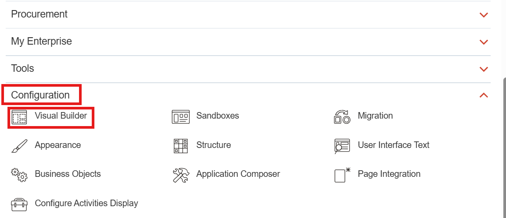

2. Click **Create**.

   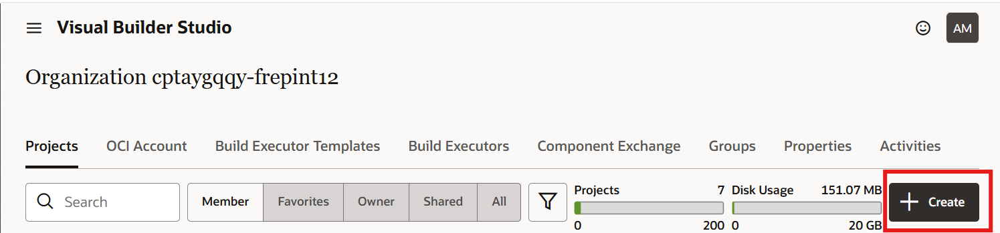

3. Enter a name. For example: **WccManagedAttachmentProject**.

4. Set **Security** to **Private** and **Discoverable** or choose **Shared** as per your requirements.

5. Click **Next**.

   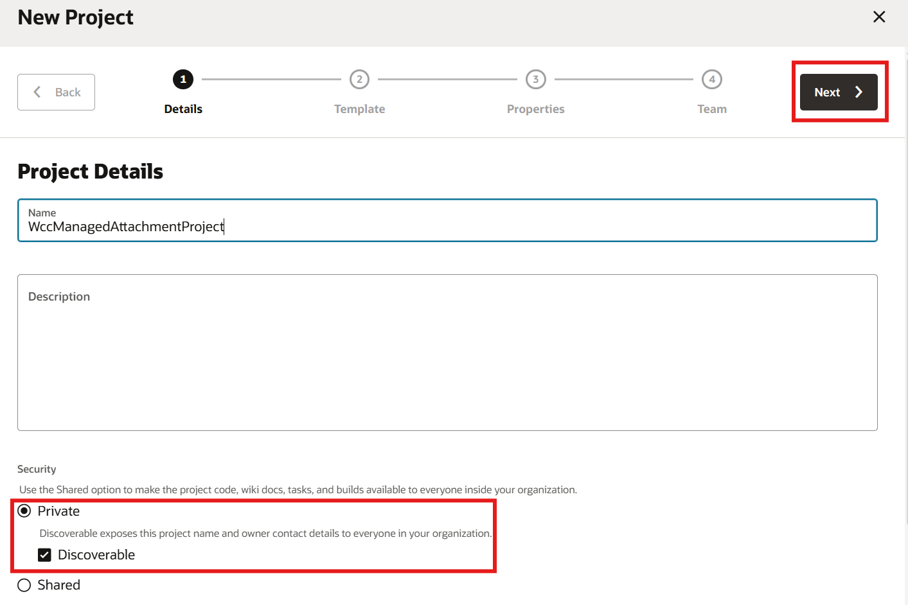

6. Set **Template** to **Empty Project**.

7. Click **Next**.

   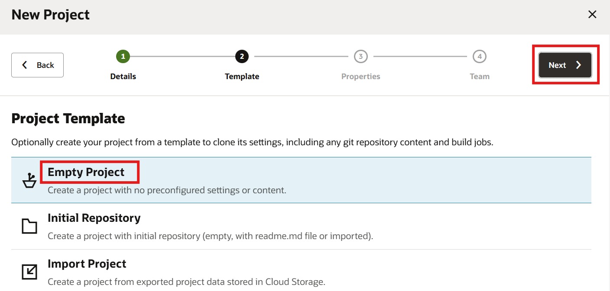

8. For **Project Properties** for **Wiki Markup**, select **Markdown**.

9. Click **Next**.

   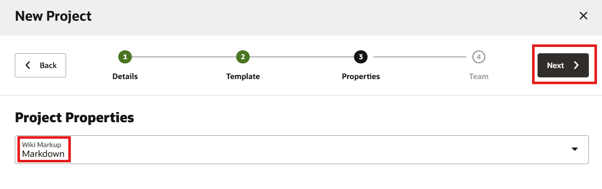

10. On the **Team** tab, add other members and their access to this project as per your requirements, and click **Add**.

11. Click **Finish**.

    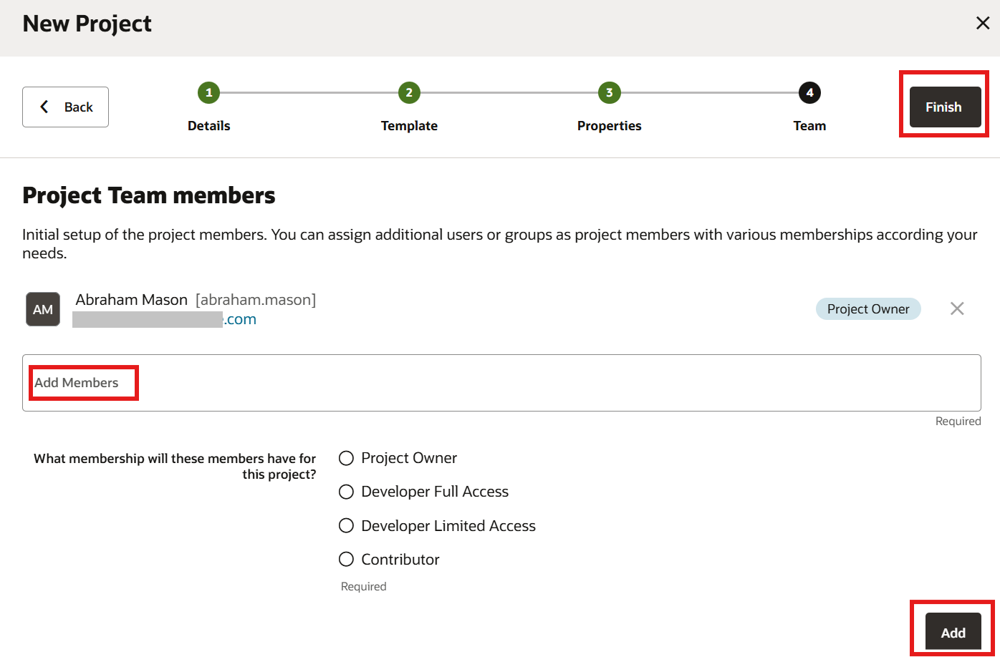

12. Wait for the project creation to finish.

## Task 2: Create a Fusion Application Cloud Environment

1. On left navigation pane, click **Environments**.

2. Click **+ Create Environment**.

3. Enter an environment name (for example, **FAEnvironment**) and a description.

4. Click **Create**.

   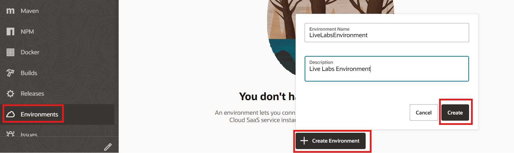

5. Select the Environment **FAEnvironment**.

6. Click **Service Instances** and then click **+ Add Instance**.

   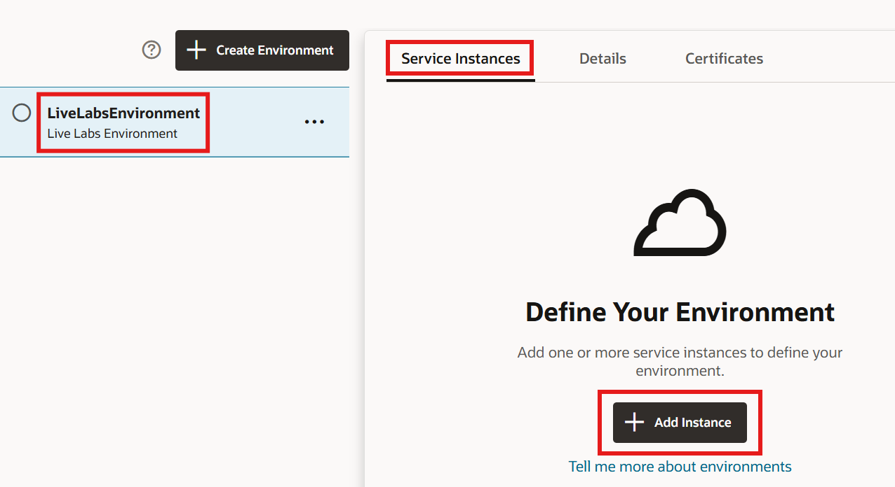

7. Complete the following:

   a. Instance Type - Select **Oracle Cloud Applications**.

   b. Add Instance Using - Select **Application Credentials**.

   c. Base URL - **{FAUrl}**

   d. Instance Name - {Name}

   e. Username - {username}

   f. Password - {password}

   g. Authorization Type - Basic

8. Click **Add**

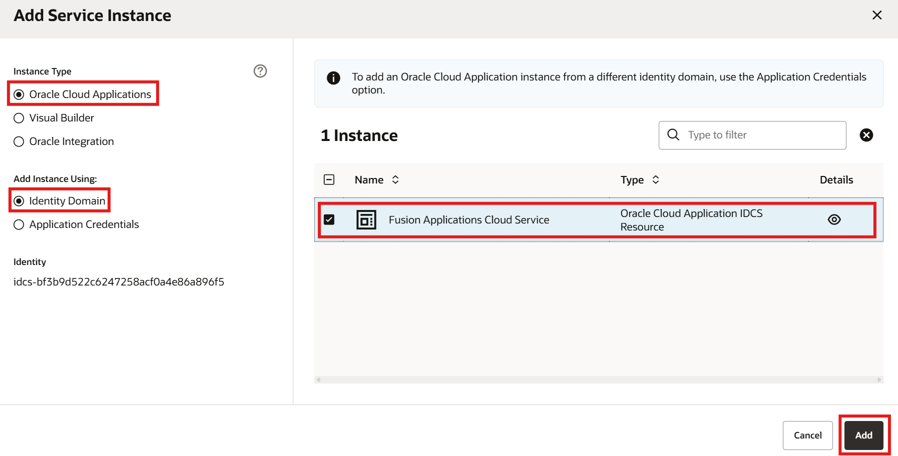

## Task 3: Click VBCS Workspace for Application Extension

1. In the project, click **Workspaces**, **New**, and then **Application Extension**.

   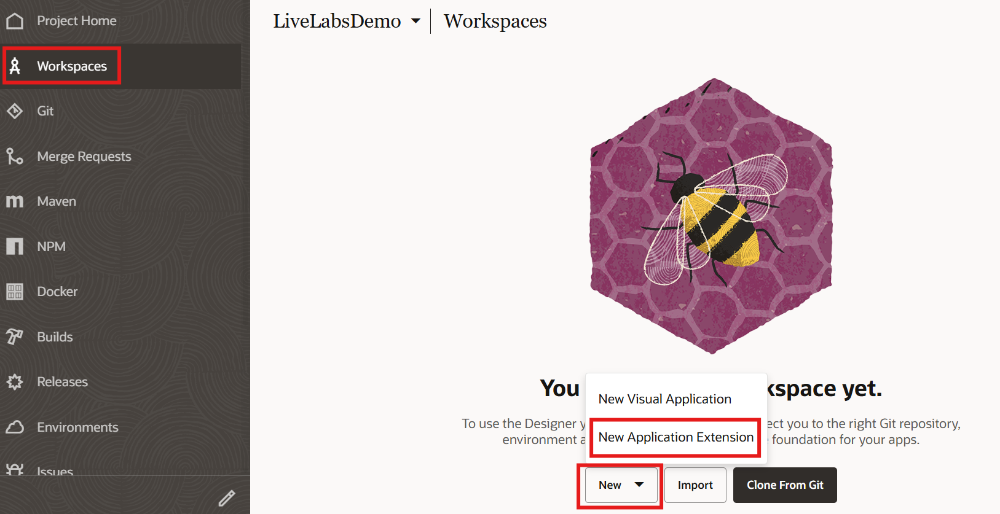

2. For **Workspace**, enter the extension name eg **WccManagedAttachmentWorkspace**.

3. The fields **Extension Id** and **Workspace Name** will be automatically populated.

4. For **Development Environment**, choose the Fusion Application Cloud Service environment created earlier eg (**FAEnvironment**).

5. For **sandbox**, choose the sandbox created earlier.

6. For **Git Repository**, select **Create new repository**. Enter a **name** and a **branch** for the repository.

7. Click **Create**.

   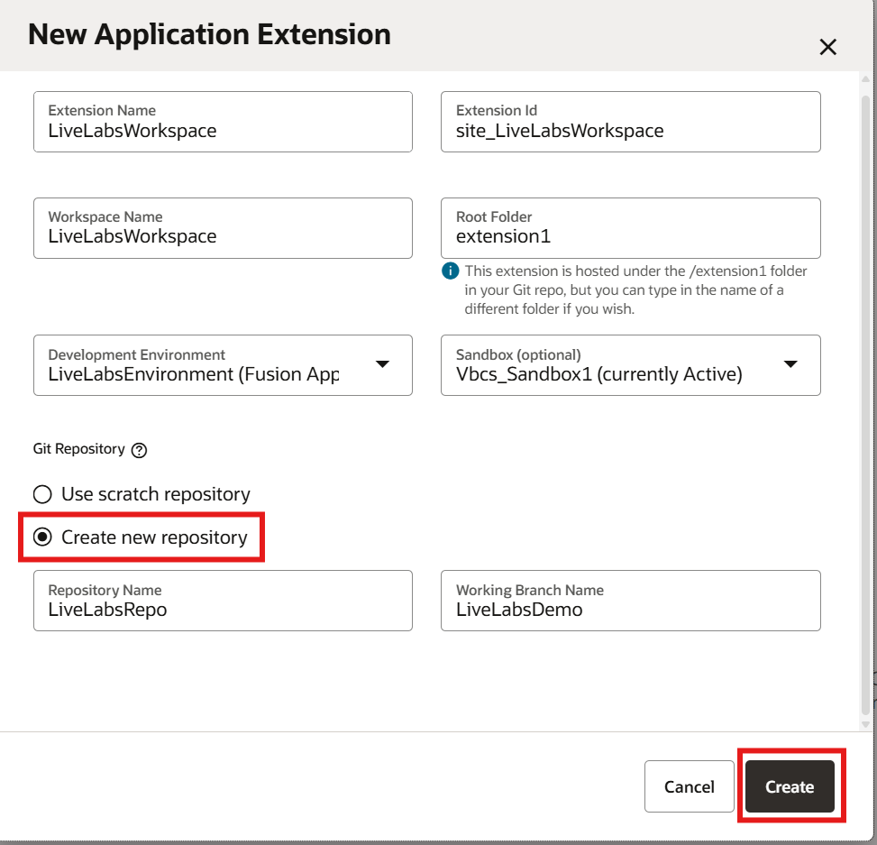

8. Wait for the application extension creation to finish.

## Task 4: Create VBCS Service for Managed Attachment Webservice

1. Click **Workspaces** and then workspace name eg **WccManagedAttachmentWorkspace** to enter the workspace.

   

2. Click **Services** and then the **+ Service Connection** button.

   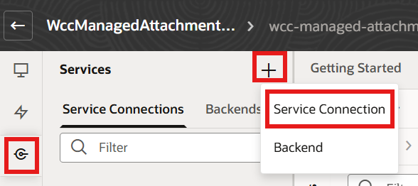

3. Select **Define by endpoint**.

   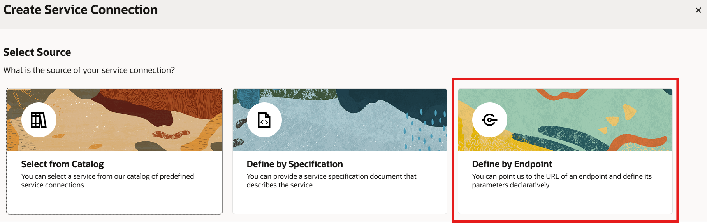

4. Set **Method** to **POST**.

5. Enter the following in the **URL** field:

   **https://{FAHost}/crmRestApi/resources/11.13.18.05/WccManagedAttachment_c/{Id}/action/GetWccMaDocsUrl**

   where **{Id}** is the Id of **WccManagedAttachment** record we obtained from the earlier step.

6. Select **Update** from the **Action Hint** drop-down list.

7. Click **Create Backend**.

   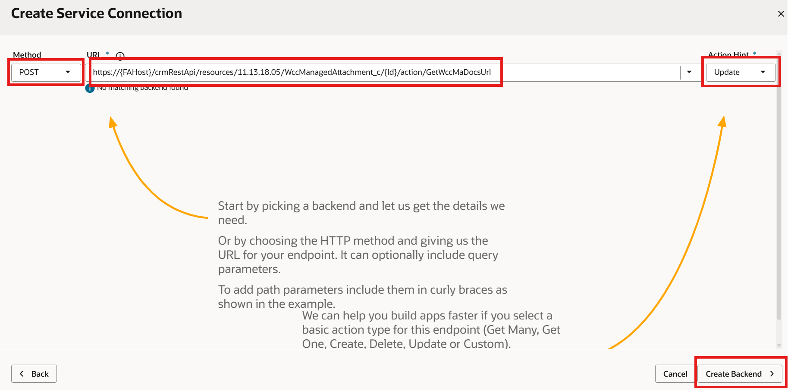

8. On the next page, enter:

   a. Backend name  - **WccManagedAttachmentBackend**

   b. Authentication  - **Oracle Cloud Account**

   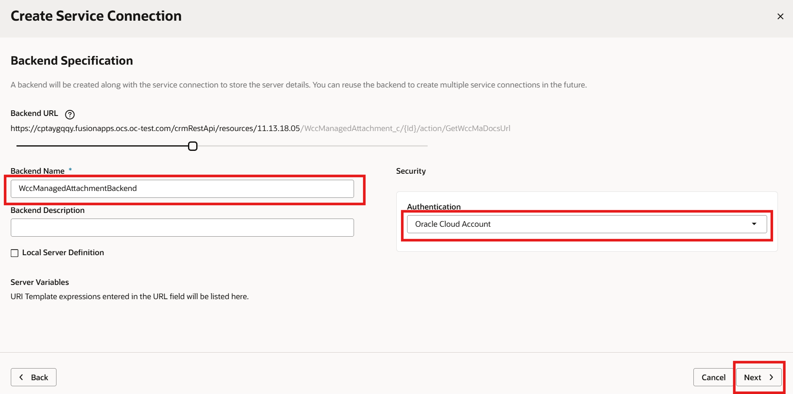

9. Click **Next** for service connection creation page.

   a. **Service name** - **WccManagedAttachmentService**

   b. Select the **Accessible to application extensions** checkbox.

   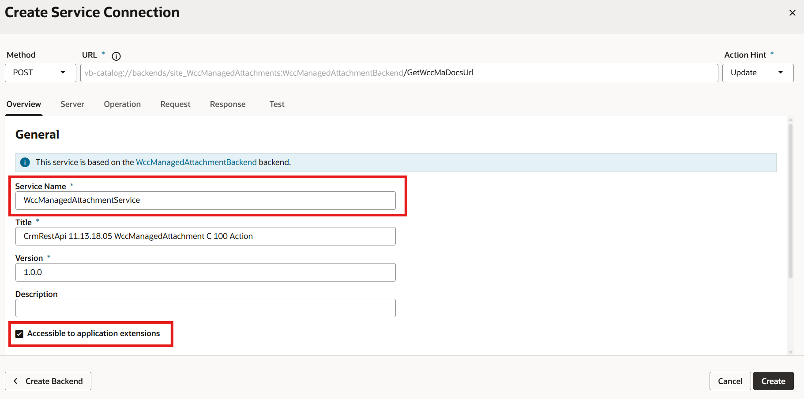

10. Click the **Request** tab and then the **Headers** tab.

11. Click **+ Static Header**.

    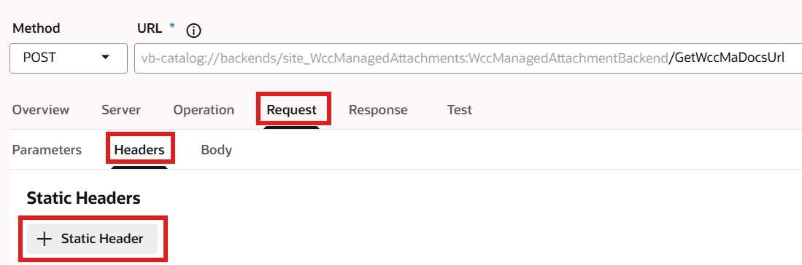

12. Enter the following:

    a. Name - **Content-Type**

    b. value - **application/vnd.oracle.adf.action+json**

13. Click **Create**.

    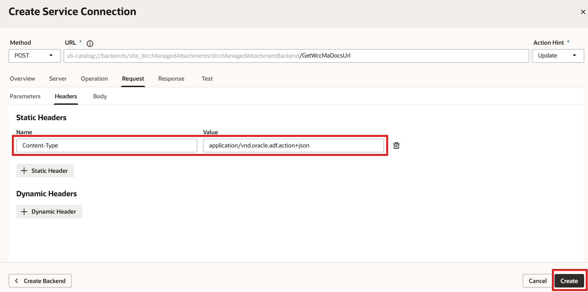

**Note:**

For the URL, you might have to replace the path **crmRestApi** with **fscmApi**, **hcmApi**, and so on in the webservice URL based on the module the custom object is created. For Example: Financials, HCM, etc.

The RestApi version **11.13.18.05** might change based on your environment.

## Task 5: Test the Web Service Call from VBCS

You can test whether this webservice call works correctly or not by following these steps:

1. Click the service **WccManagedAttachmentService**, **Endpoints**, **/GetWccMaDocsUrl**, row with **POST** method.

   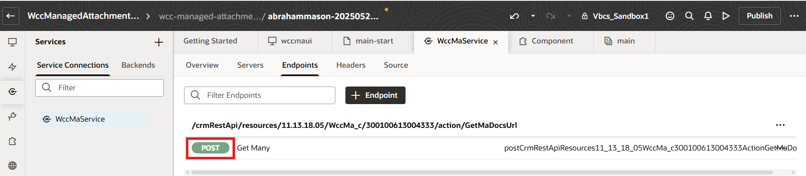

2. Click the **Test** tab and in the **Body** tab, enter:

   a. Media type - **application/vnd.oracle.adf.action+json**

   b. Payload as type - **Text**

3. Enter the following value:

    ```json
    <copy>
    {
       "appName": "<appName>",
       "boType": "Invoice",
       "boKey1": "InvoiceNumber",
       "boValue1": "<InvoiceNumber>"
    }
    </copy>
    ```

4. Click **Send Request**.

   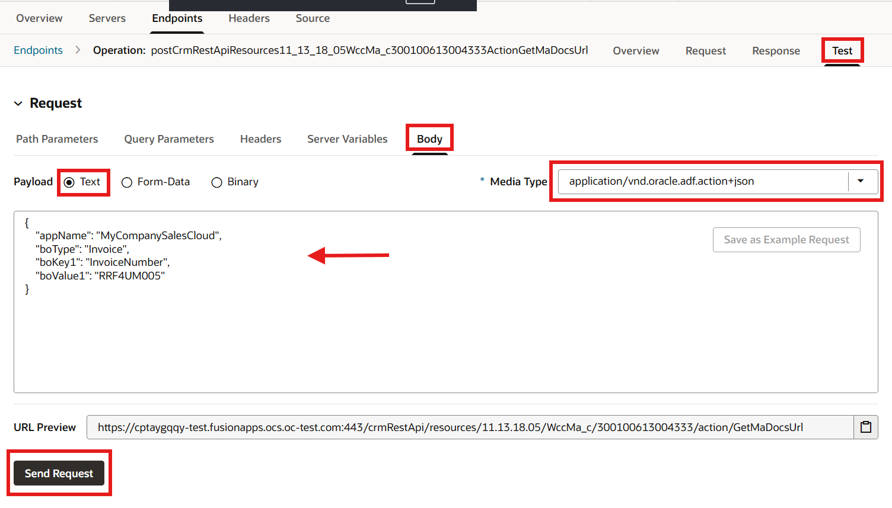

You should get appropriate response based on whether the invoice with InvoiceNumber is accessible to you or not.

- If invoice is accessible, then the response will be a JSON response with value as GUID in the format "&afGuid={guid}".
- If invoice is not accessible, then the response will be a JSON with an "{Error Message}".
- If there is an error in the set-up, then an error indicating it will be displayed.

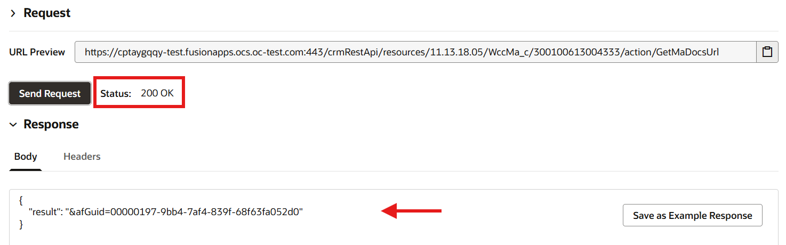

## Task 6: Create Managed Attachment UI for the Application Extension

1. Click the **App UIs** section.

2. Click the **+ App UI** button.

3. Enter a name for the app UI (for example: **WccManagedAttachmentUI**) and click **Create**.

   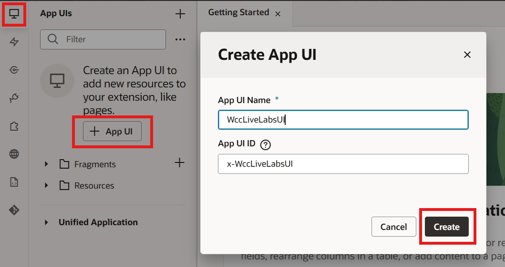

4. In the App UI tree, click UI name eg **wccmanagedattachmentui**, **main**, **main-start** and **Design** tab.

5. Click the **Properties** tab on the right.

6. Click **Select Page Template**.

   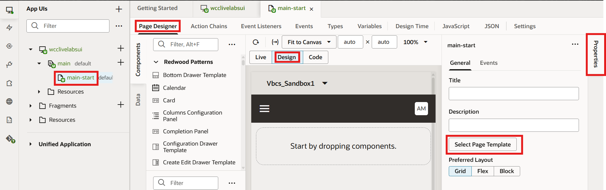

7. Under **Page Content** select **Welcome Page Template** and click **Select**.

   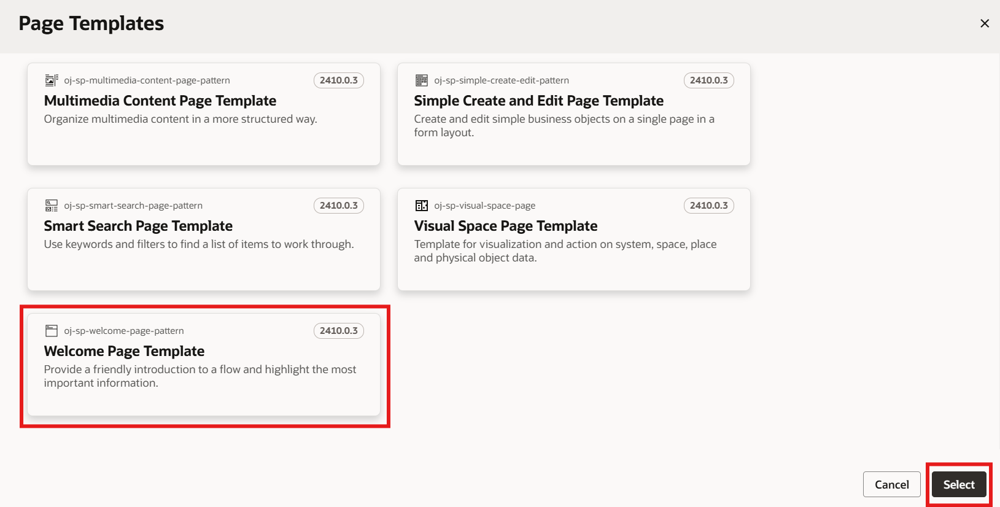

8. Click **Page Designer** tab and then select **Welcome Page Template** in **Design** tab.

9. On the **Design** tab, select the template, select **Properties**, and provide a title in the **Page Title** field (for example: **Managed Attachments**).

   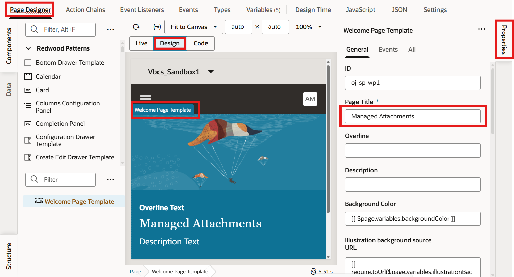

10. Click the **Variables** tab and add variables with following IDs by clicking **+ Variable** button

      - appName, boType
      - boKey1, boKey2, boKey3, boKey4, boKey5
      - boValue1, boValue2, boValue3, boValue4, boValue5

11. For all the variables, specify the following:

    a. Type - **String**

    b. Description - You can enter the variable name or specify a suitable description.

    c. Access for application extensions - **Read/Write**

    d. Input parameter - Select **Enabled**.

    e. Pass on URL check box - Select this check box.

    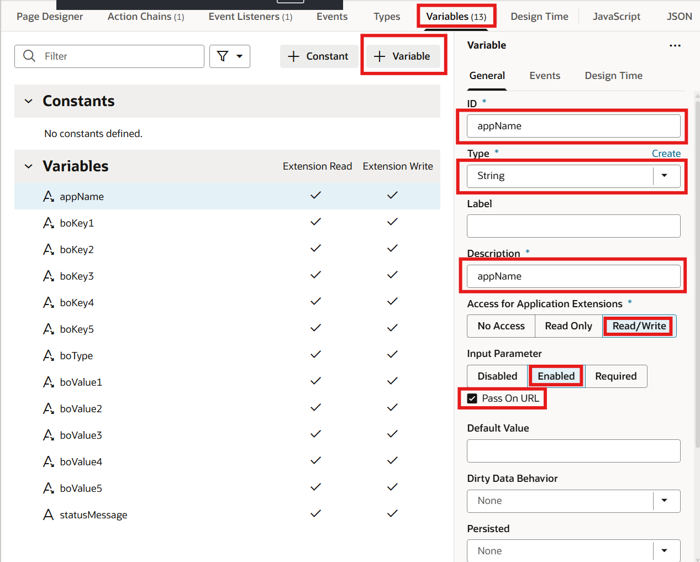

12. Add a variable with **statusMessage** as the ID and with the following properties:

    a. Type - **String**

    b. Description - You can enter the variable name or specify a suitable description.

    c. Access for application extensions - **Read/Write**

    d. Input parameter - Select **Disabled**.

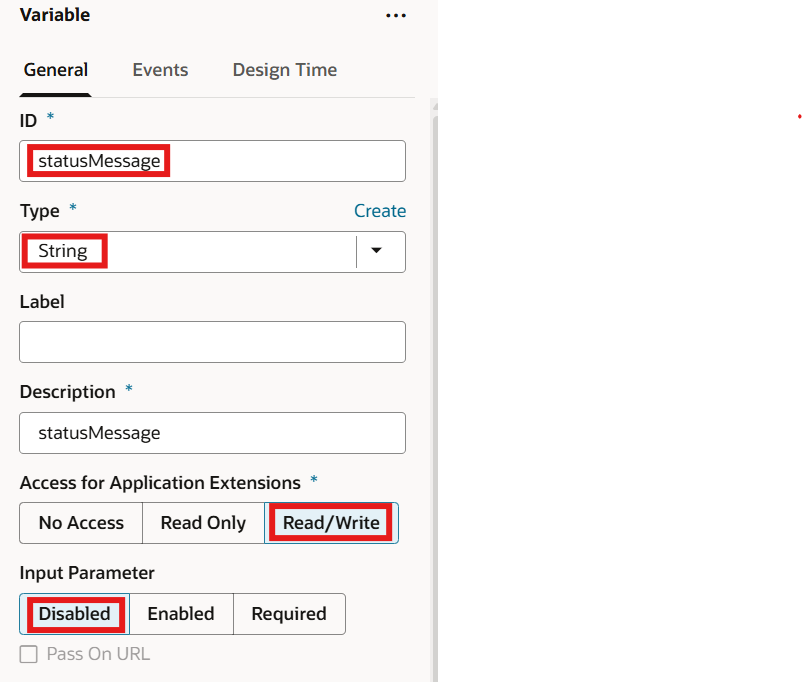

## Task 7: Add a Text Field to Show the Current Status of Processing

1. In the App UI tree, click App name eg **wccmanagedattachmentui**, **main**, and then **main-start**.

2. Click the **Page Designer** tab.

3. On the left navigation pane, click **Components**, click **Text Box** input field on the top with the hint text **Filter**, and then search by typing the word **Text**.

4. In the search results select the component named **Text**, drag and drop it into the **Welcome Page Template**.

   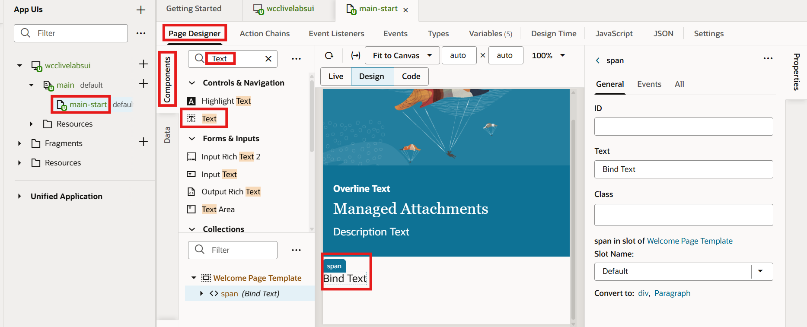

5. Bind the text field to the **statusMessage** variable using the following steps:

   a. Select the inserted text component on the canvas.

   b. Click the **Properties** tab on the right.

   c. Click the **Text** field.

   d. Click Icon **(x)** with text **Select variable**, in text field type **statusMessage**, and then select **statusMessage** from results.


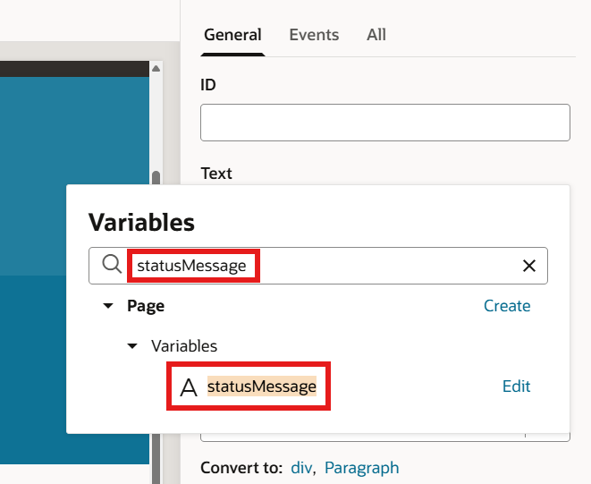

## Task 8: Call the REST Webservice from the VBCS Management Attachment UI to Obtain the Attachment GUID

1. If you are not already in the **main-start** element in the App UI tree, click App name for eg **wccmanagedattachmentui**, **main**, and then **main-start**.

2. Click **Action Chains** tab and then click **+ Action Chain**.

3. Enter a name (for example, **WccMaActionChain**).

4. Click **Create**.

   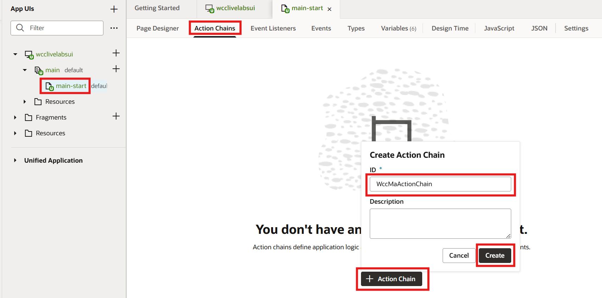

5. Click the **Event Listeners** tab, click **+ Event Listener**, click **Lifecycle Events**, **vbEnter** and lick **Next**.

   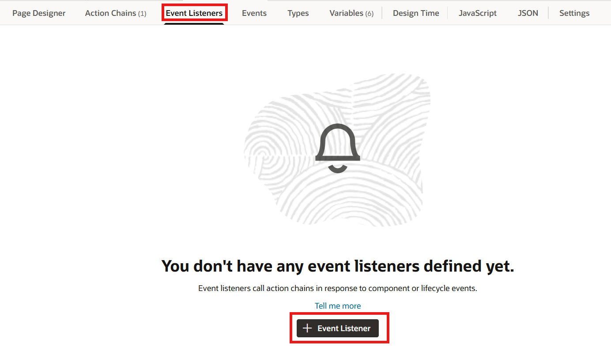

   

6. On the next page, for **Select Action chain**, select **Page Action Chains** and then **WccMaActionChain** and click **Finish**.

   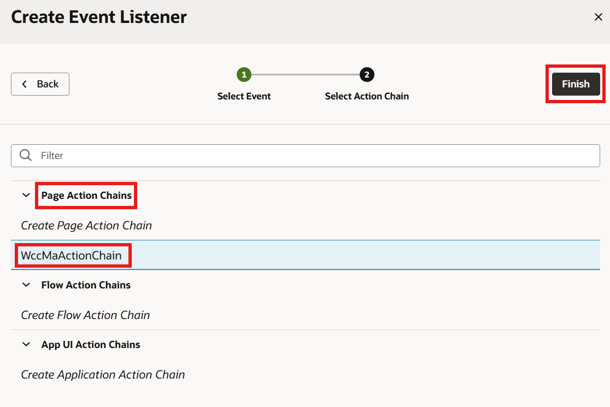

7. Click tab **Action chains** and then **WccMaActionChain**.

   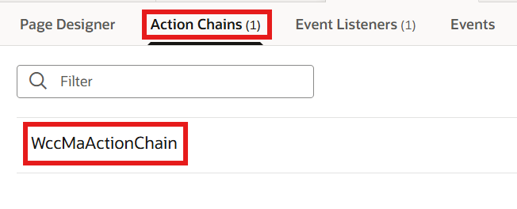

8. Select the code editor by clicking the **code** tab. You should be in the **WccMaActionChain** code editor now.

   ```javascript
   class WccMaActionChain extends ActionChain {
      async run(context) {
      const { $page, ...} = context;

      // Paste Here
   ```

9. Download the [MA action chain](files/ma-action-chain.js?download=1) javascript code.

10. Copy and paste the code from the script to the place indicated above.

    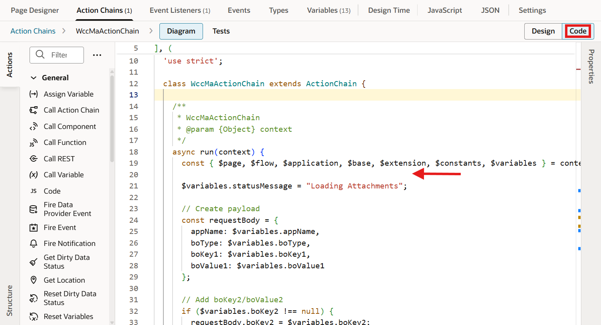

11. For the Rest API call, change the endpoint name **{Service Endpoint}** to your endpoint name.

12. Alternatively, you can also use the following steps:

    a. Click the line with text **{Service Endpoint}**.

    b. In properties panel click **Select** under **Endpoint**.

    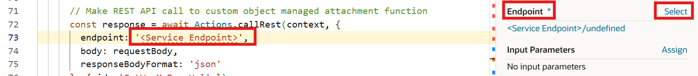

    c. In the selection popup expand Services, WccMaService.

    d. Select the element with text **POST .../GetWccMaDocsUrl**.

    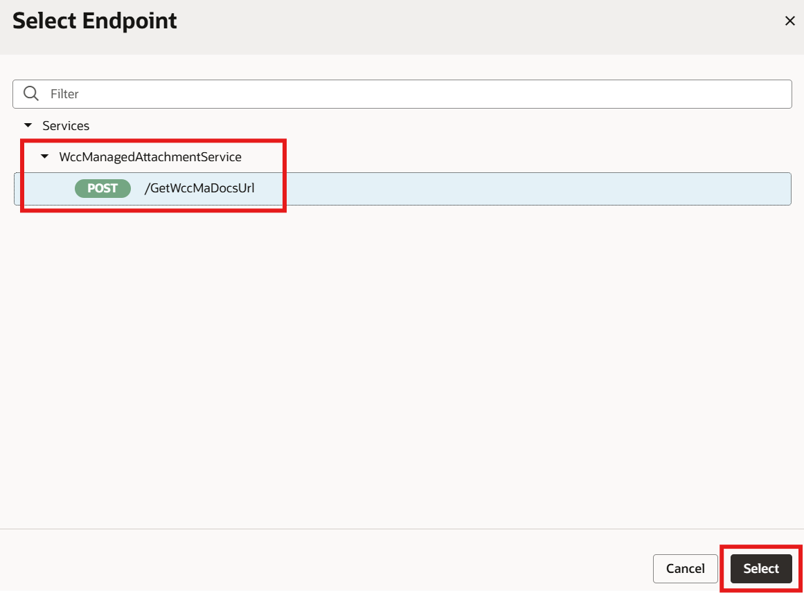

    e. In the window with code for the selected line make sure that the other properties, that is - **body**, **responseBodyFormat** to call the API are provided as specified below.

      ```javascript
      const response = await Actions.callRest(context, {
         endpoint: '<Service Endpoint>',
         body: requestBody,
         responseBodyFormat: 'json'
      }, { id: 'GetWccMaDocsUrl' });
      ```

    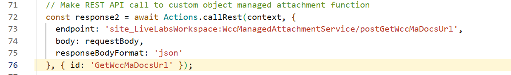

13. In the code, replace **{WCCHost}** and **{WCCPort}** with the relevant host and port values as per your environment.

   ```javascript
   const managedAttachmentUrl = "https://{WCCHost}:{WCCPort}/cs/idcplg?IdcService=EMBEDLOGIN_HOME&ActAsAnonymous=true";
   ```

In the code, there are Javascript console log statements for debugging on the browser console. Change those statements to comments before publishing the application extension.

## Task 9: Test the VBCS Application Extension

1. Click the **Preview** button at the top panel extreme right.

   VBCS will compile the application and open a URL in browser. The URL might fail now as we have not passed any relevant URL parameters.

   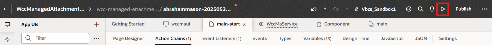

2. Copy the URL which will be in the following format and note it down.

      ```text
      https://{FAHost}/fscmUI/redwood/WccManagedAttachmentUI?vbdt%3ApreferExtensionVersion=<value>
      ```

3. Test the URL in the browser by passing test parameters.

      ```text
      https://{FAHost}/fscmUI/redwood/WccManagedAttachmentUI?vbdt%3ApreferExtensionVersion=<value>&appName=<appName>&boType=Invoice&boKey1=InvoiceNumber&boValue1=<TestInvoiceNumber>
      ```

Based on the type of object you are trying to integrate, the parameters may change and the URL may have additional key values pairs boKey2, boValue2 ... boKey5, and boValue5.

The VBCS application extension will call the Managed Attachment REST webservice, obtain the unique GUID for the combination of keys passed, and open the associated managed attachments page.

**Note:**

Before the VBCS app is published, the app URL will be in the above format with a reference to the extension version which can be used for testing.

After it is published, the URL will be in the following format (without the extension version).

```text
https://{FAHost}/fscmUI/redwood/WccManagedAttachmentUI
```

## Acknowledgements

- **Authors-** Ratheesh Pai, Senior Principal Member Technical Staff, Oracle WebCenter Content
- **Contributors-** Ratheesh Pai, Rajiv Malhotra, Vinay Kumar
- **Last Updated By/Date-** Ratheesh Pai, June 2025
