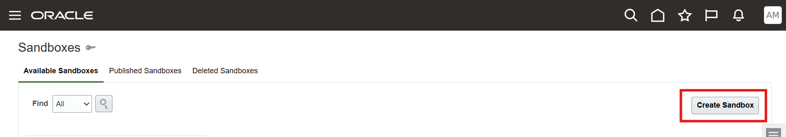

# Create a sandbox and add WebCenter Content Grant Webservice in Fusion Apps

## Introduction

In this lab, we will create a sandbox and add Grant Webservice in Fusion Apps

**Estimated Lab Time**: *15 minutes*

### Objectives

In this lab, you will

- Create a sandbox in Fusion Apps
- Create a WebCenter Content based Grant webservice in Fusion Apps

### Prerequisites

This lab assumes you have:

- A Paid or LiveLabs Oracle Cloud account
- WCC Marketplace instance with HTTPS enabled Content Server URL
- Access to an Oracle Fusion Applications instance
- All previous labs successfully completed

## Task 1: Create a sandbox in Fusion Apps

Create a sandbox to implement the Oracle Fusion Apps changes for this integration:

1. Sign in to Oracle Fusion Apps as an administrator.

2. Click the hamburger icon in the upper left corner of the page. Select the **Configuration** option from the menu and then select **Sandboxes**.

   

   

3. On the Create Sandbox page, complete the following fields:

    a.  On the Sandboxes page, click **Create Sandbox**.

    

    b.  On the Create Sandbox page, specify a name for this sandbox in the **Name** field (for example, WebCenter Content Records Management Integration).

    c.  From the **All Tools** list, select the **Application Composer** and **Page Composer** check boxes.

    

    

    d.  Click **Create and Enter**.

    

## Task 2: Create WebCenter Content Grant Webservice

1. To enter the application composer where you will be making your WebCenter Content integration changes, click **Tools** in the upper left corner of the page and then select **Application Composer** from the drop-down list.

   

2. Choose **Common Setup** and then **Web Services** from the left navigation menu.

   

   

3. On the Web Services page, click the **Create a new Web Service** icon.

   

4. In the Select Connection Type dialog, select the **SOAP** option and click **OK**.

   

5. On the Create SOAP Web Services Connection page, complete the following fields:

    a.  In the **Name** field, specify **WebCenterContentGrantWebservice** as the name of the field.

    b.  In the **URL** field, enter **`https://<WebCenter Content URL>/idcws/AfGrantAccess?WSDL`** as the web service URL.

    c.  Click **Read WSDL**.

    d.  Navigate to **Security**, **Security Scheme**, and then select **Call with basic authentication**.

    

    e.  In the **Credential key** field, click **+** to add a credential key. If credentials for this web service already exist, you can select the existing credentials, otherwise, create one using the following steps.

     i.  Credential Key - Specify a name.

     ii. Username - If WebCenter Content is configured with IDCS Single Sign-on, then specify the administrator name for WebCenter Content IDCS, otherwise, specify the administrator name for WebCenter Content Weblogic.

     iii. Password - If WebCenter Content is configured with IDCS Single Sign-on, then specify the administrator password for WebCenter Content IDCS, otherwise, specify the administrator password for WebCenter Content Weblogic.

     

**Note**: For WebCenter Content web service, use HTTPS-based URL (not HTTP-based). Also, the URL should have valid HTTPS certificates because the FA connection to the web service will not work without valid HTTPS certificates. It will not work with self-signed certificates.

## Acknowledgements

- **Authors-** Ratheesh Pai, Senior Principal Member Technical Staff, Oracle WebCenter Content
- **Contributors-** Ratheesh Pai, Rajiv Malhotra, Vinay Kumar
- **Last Updated By/Date-** Ratheesh Pai, June 2025
