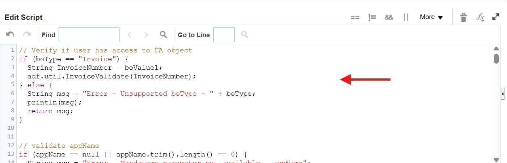
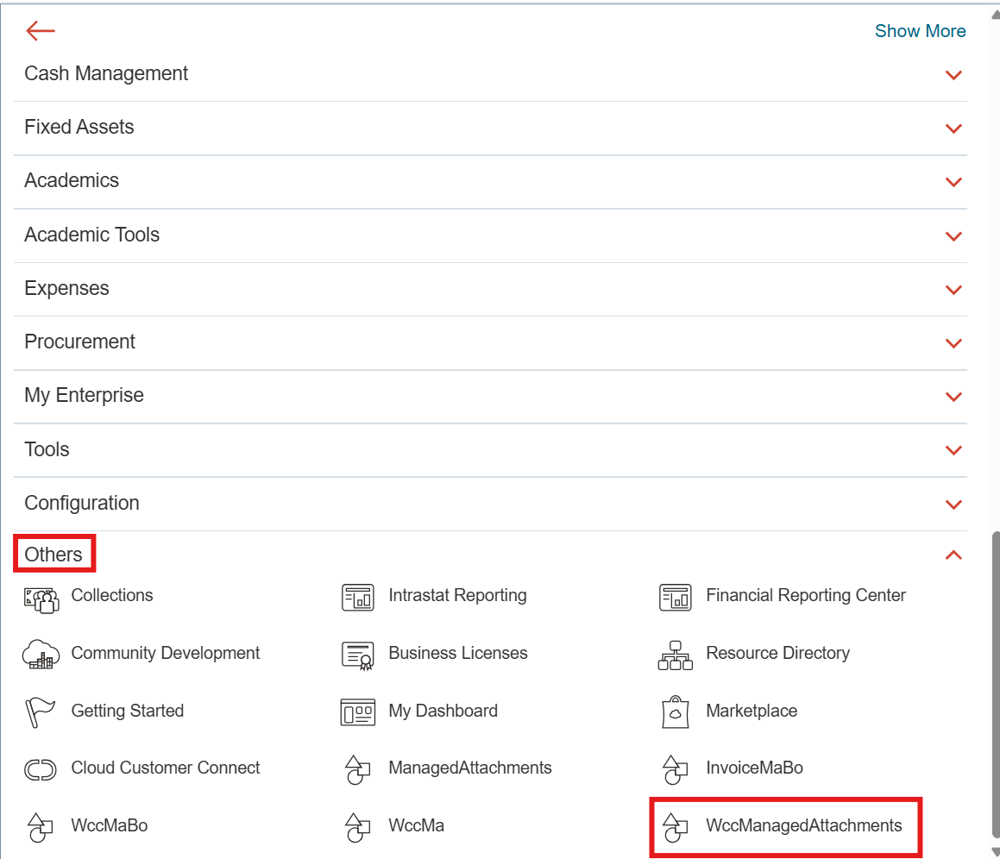

# Create Custom Object-Based Webservice to Generate Managed Attachment GUID

## Introduction

In this lab we will create a custom object-based webservice to generate managed attachment GUID

**Estimated Lab Time**: *30 minutes*

### Objectives

In this lab, you will

- Create a custom business object in Fusion Apps
- Create a function to obtain and expose the managed attachments GUID as a REST webservice
- Create a custom object instance to call the managed attachments REST webservice
- Disable delete of custom object records

### Prerequisites

This lab assumes you have:

- A Paid or LiveLabs Oracle Cloud account
- Access to an Oracle Fusion Applications instance with integrated Oracle Visual Builder Cloud Service.
- All previous labs successfully completed

## Task 1: Create a Custom Business Object

1. Click the "+" sign next to **Custom Objects**.

   

2. Enter details of the custom object as follows:

   a. Display Label - **WccManagedAttachment**

   b. Plural Label - **WccManagedAttachments**

   c. Record Name Label - **WccManagedAttachment**

   d. Record Name Data Type select - **Automatically Generated Sequence**

   e. Sequence Format - Choose a prefix and sequence. For example: MA-{0000000}-{YY}{MM}{DD}

   f. Object Name - **WccManagedAttachment**

   g. Description - **Wcc Managed Attachment**

   

3. Click OK and wait for the custom object to get created.

4. Click **Pages** and click **Create Default Pages**.

   

   

## Task 2: Create a Function to Obtain and Expose the Managed Attachments GUID as a REST Webservice

1. For custom object **WccManagedAttachment**, click **Server Scripts**, **Object Functions**, and then the **Add a new Object Function** button.

   

2. Enter details as follows:

   a. Function Name - **GetWccMaDocsUrl**

   b. Type - **Row Level**

   c. Returns - **String**

   d. Visibility - **Callable by External Systems**

   

3. Parameters:

   Create parameters of type String with the following names:

    - appName, boType

    - boKey1, boKey2, boKey3, boKey4, boKey5

    - boValue1, boValue2, boValue3, boValue4, boValue5

   

4. Download the [custom object webservice](files/custom-obj-ws.groovy) groovy code.

5. For script code paste the contents of the downloaded script.

   

6. Click **Validate** and then **Save and Close**

   

These variables are mandatory to be passed to the function.

- appName, boType, boKey1, boValue1

Other key value pairs (boKey2 .. boKey5), (boValue2 .. boValue5) are optional. The pairs (if provided) should have both key and value given together.

All these variables are mapped to payload fields in WebCenter Content Grant Webservice: applicationName, businessObjectType, businessObjectKeys and businessObjectValues.

The maximum character lengths of various parameters as they are mapped to above fields are as follows:

- appName: 20
- boType: 100
- boKey\'s: 80
- boValue\'s: 80

**Important:**

These variables should form a unique combination to attach to the documents. They should be provided the same values consistently for a given object record so that previously attached documents (if any) are retrieved using the same combination of values.

**Note:**

You can use the same webservice for different types of modules. For example, if you want to integrate with Expense Item object, add a condition for the variable boType like below:

```text
...
else if (boType == "ExpenseItem") {
  String ExpenseId = boValue1;
  adf.util.ExpenseItemValidate(ExpenseId);
}
```

where **ExpenseItemValidate** is the global function you have to create to verify if the current user has access to the given expense item by calling Expense REST API of Fusion Cloud.

## Task 3: Create a Custom Object Instance to Call the Managed Attachments REST Webservice

1. Select **Navigator**, **Others**, and then **WccManagedAttachments**.

   

   

2. Click **Create** and then **Save and Close**.

   

   

3. To get the record ID of this object, run the following command on a Linux command line shell:

```bash
<copy>
curl -k --location 'https://{FAHost}/crmRestApi/resources/11.13.18.05/WccManagedAttachment_c' \
   --header 'Authorization: Basic {Base64EncodedCredentials}'
</copy>
```

   where **{Base64EncodedCredentials}** is the credentials string "**{username}:{password}**" in base64 encoded form.

**Note:**

You might have to replace the path **crmRestApi** with **fscmApi**, **hcmApi**, and so on based on the module the custom object is created if you are integrating with any other module. For example, Financials, HCM, etc.

The Rest API version **11.13.18.05** might change based on your environment.

It returns the Managed attachments object record in JSON format.

Pick the ID of the record and note it down.

Example:

```text
"Id" : 300100613004497,
```

We will call the row level REST API **GetWccMaDocsUrl** on this particular record. There is no other purpose for **WccManagedAttachment** object or this record. Its only purpose is to call this REST API. This particular record should not be deleted.

## Task 4: Disable Delete of WccManagedAttachment Records

As you have created the record on which you will call the REST API, you will need to disable the deletion of the records of this WccManagedAttachment object:

1. Select the **WccManagedAttachments** custom object in **Application Composer**.

2. Select **Security**.

   

3. In the **Delete** field, deselect all the options.

4. Click **Save and Close**.

   

We will call this webservice in a subsequent lab. You may proceed to the next lab.

## Acknowledgements

- **Authors-** Ratheesh Pai, Senior Principal Member Technical Staff, Oracle WebCenter Content
- **Contributors-** Ratheesh Pai, Rajiv Malhotra, Vinay Kumar
- **Last Updated By/Date-** Ratheesh Pai, June 2025
