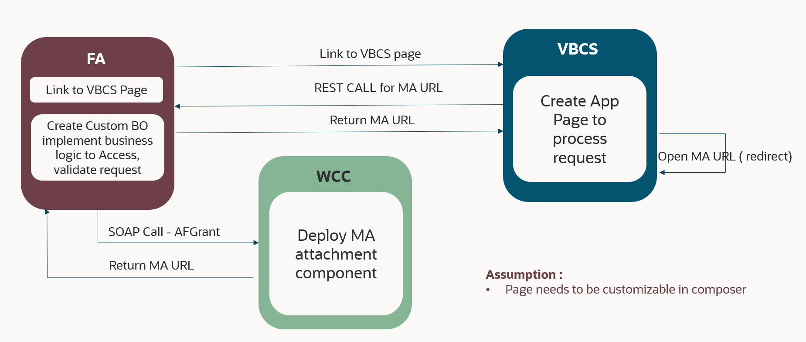

# Introduction

Learn how to extend Oracle Fusion Applications by adding Managed Attachments using Page Composer and Visual Builder Cloud Service based Application Extension

## About this Workshop

Organizations have requirements to attach supporting documents to specific records to various modules in Oracle Fusion Apps. This lab would help set it up with **Payables** - **Invoices** module as an example.

*Estimated Time:* 3 hours

### **About extending Oracle Fusion Applications by adding Managed Attachments using Page Composer and VBCS Application Extension**

The objective of this lab is to implement the ability to add attachments respective to a given record in **Payables**, **Invoices** module as an example. A custom business object is created which validates access for a user to a given Fusion Apps record using FA REST webservices and then makes a SOAP call to WebCenter Content Grant webservices to get a URL with unique managed attachment GUID. The page is then used for attaching documents specific to the record. The UI is developed in integrated Oracle Visual Builder Cloud Service and the link to the page with applicable binding parameters for the record is inserted in the Fusion Applications module page using Page Composer.  

### **Objectives**

In this lab, you will:

* Configure WebCenter Content for Fusion Apps Integration
* Create VBCS Based Application Extension
* Use Page Composer to Insert Managed Attachments Link in Fusion Applications Page
* Publish the application and use it

### **Prerequisites**

This lab assumes you have:

* Paid or LiveLabs Oracle Cloud account
* WCC Marketplace instance with HTTPS enabled Content Server URL
* Access to an Oracle Fusion Applications instance with integrated Oracle Visual Builder Cloud Service.
* Chrome browser as Oracle Visual Builder Cloud Service is supported only in Chrome browser.

You may now **proceed to the next lab**.

### **Learn More**

* [Introduction To WebCenter Content](https://docs.oracle.com/en/middleware/webcenter/content/12.2.1.4/index.html)

## Acknowledgements

* **Authors-** Ratheesh Pai, Senior Principal Member Technical Staff, Oracle WebCenter Content
* **Contributors-** Ratheesh Pai, Rajiv Malhotra, Vinay Kumar
* **Last Updated By/Date-** Ratheesh Pai, June 2025
