# Use Page Composer to Insert Managed Attachments Link in Fusion Applications Page

## Introduction

In this lab, we will use page composer to insert managed attachments Link in Fusion Applications page of **Payables**, **Invoices** module

**Estimated Lab Time**: *15 minutes*

### Objectives

In this lab, you will

- Use page composer to insert managed attachments Link in Fusion Applications page of **Payables**, **Invoices** module

### Prerequisites

This lab assumes you have:

- A Paid or LiveLabs Oracle Cloud account
- Access to an Oracle Fusion Applications instance with integrated Oracle Visual Builder Cloud Service.

## Task 1: Use Page Composer to Insert Managed Attachments Link in Fusion Applications Page

1. Navigate to **Payables** and then **Invoices**.

   

   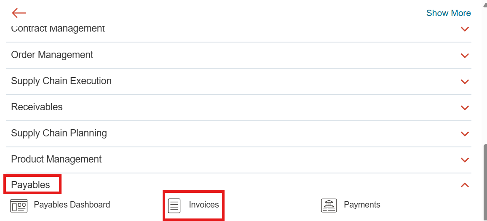

2. Search and open an invoice record or click one of the cards to get a list of invoices in the card and select a  invoice and open it.

   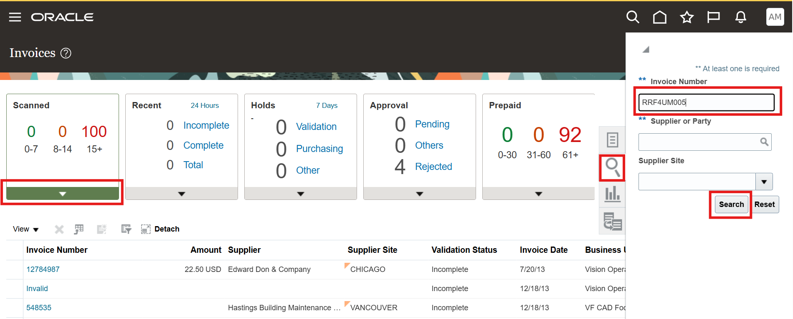

   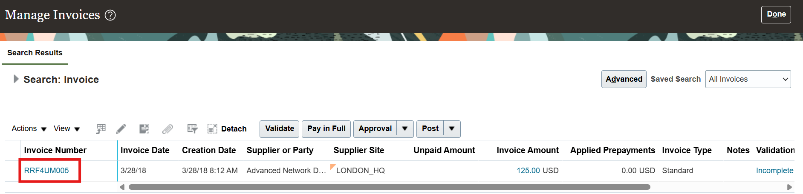

3. Select **Tools** and then **Page Composer**.

   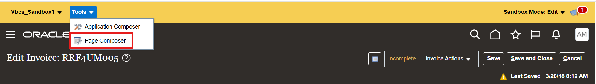

4. Click **Structure**.

5. Select the structure pane (which is available by default at the bottom of the page).

6. In the structure pane select the UI element on which you need to insert the hyperlink. Click the **+** button in the panel.

   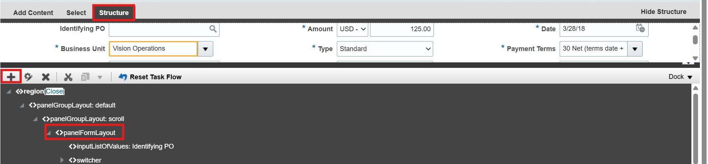

7. In the **Add Content** pop-up, select **Components** and click **Open**.

   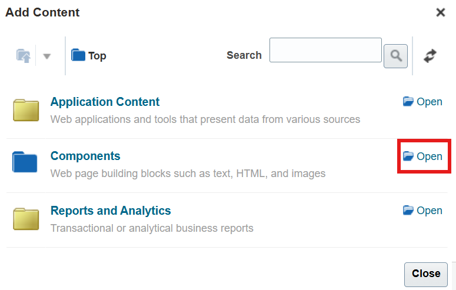

8. Select **Hyperlink** and click **+Add** and click **Close**.

   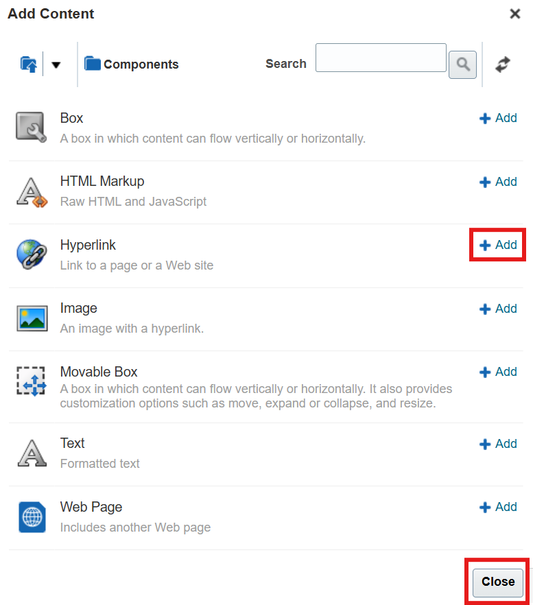

9. In the **structure** pane, select the hyperlink you just added.

   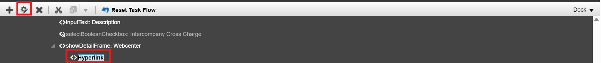

10. Enter

    a. Destination

    ```text
    <copy>
    https://{FAHost}/fscmUI/redwood/WccManagedAttachmentUI?vbdt%3ApreferExtensionVersion={version}&appName={appName}&boType=Invoice&boKey1=InvoiceNumber&boValue1=#{bindings.InvoiceNum.inputValue}
    </copy>
    ```

    The URL is from the Lab - `Create VBCS-Based Application Extension`. Replace values for **{version}**, **{appName}** as applicable. The parameter **boValue1** is set as a bindings parameter value of invoice number of the current invoice.

    b. Short Desc - **Documents**

    c. Target Frame - **_blank**

    d. Text - Click **Expression Builder**,in **Expression Editor** select **Type a value or expression** and enter **Documents** and click **OK**.

       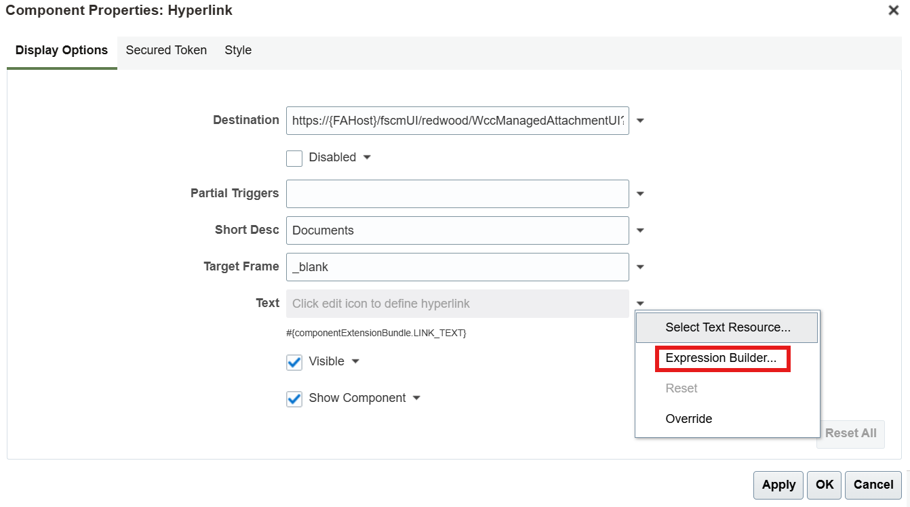

       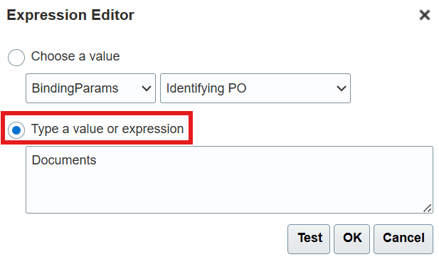

11. Click **OK** in the hyperlink properties dialog.

12. Close the Page Composer by clicking **Close**.

    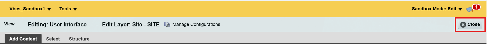

## Acknowledgements

- **Authors-** Ratheesh Pai, Senior Principal Member Technical Staff, Oracle WebCenter Content
- **Contributors-** Ratheesh Pai, Rajiv Malhotra, Vinay Kumar
- **Last Updated By/Date-** Ratheesh Pai, June 2025
