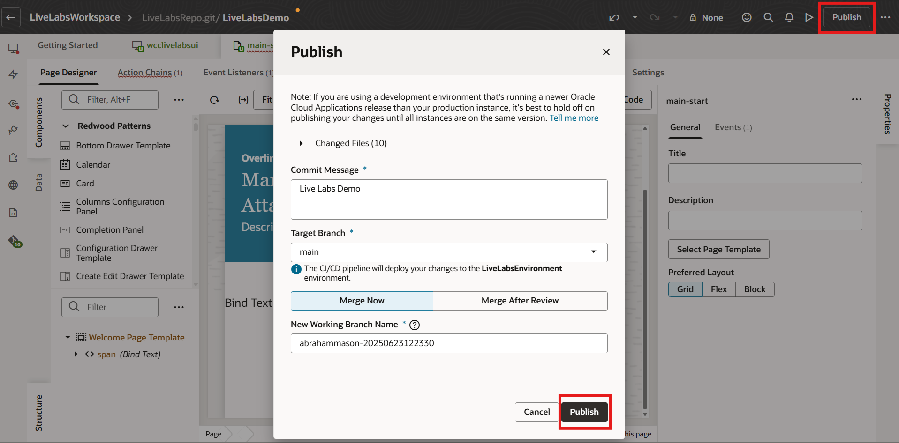
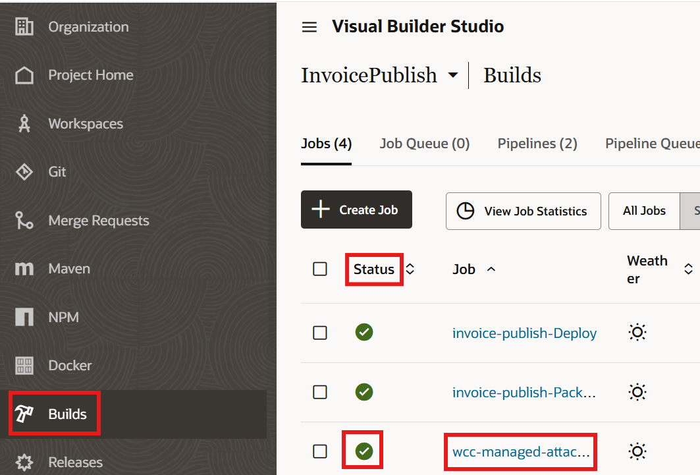
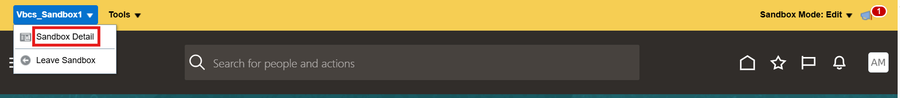
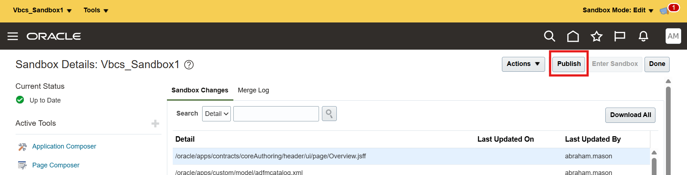

# Publish VBCS App Extension and Fusion Application Sandbox

## Introduction

In this lab we will publish the VBCS app extension and Fusion Application sandbox

**Estimated Lab Time**: *10 minutes*

### Objectives

In this lab, you will

- Publish the VBCS extension
- Change the VBCS app link URL to published URL in **Payables**, **Invoices** module
- Publish the Fusion Applications sandbox

### Prerequisites

This lab assumes you have:

- A Paid or LiveLabs Oracle Cloud account
- All previous labs successfully completed
- Access to an Oracle Fusion Applications instance with integrated Oracle Visual Builder Cloud Service.
- Chrome browser as Oracle Visual Builder Cloud Service is supported only in Chrome browser.

## Task 1: Publish the VBCS extension

1. On the VBCS page, for the Action Chain **WccMaActionChain** code, comment out the console.log debug statements as the code is now working in the environment.

2. Navigate to the VBCS page for the project **WccManagedAttachmentProject**.

3. Click **Publish**.

4. Select **Merge Now**, enter a commit message, and click **Publish**.

   

5. Enter Fusion Applications credentials if prompted.

6. This will perform a schedule build of jobs whose status can be viewed by clicking **Builds** on the left pane.

7. Wait for the publish job to complete.

   

Now the published URL of VBCS app extension will be in following format ie without the 'vbdt%3ApreferExtensionVersion' parameter which was in the preview URL.

```text
https://{FAHost}/fscmUI/redwood/WccManagedAttachmentUI
```

## Task 2: Change the VBCS App Link URL to Published URL for the module

On the **Payables**, **Invoices** page, we inserted the hyperlink as the URL under development (which has the extension version) using the steps in  Lab - `Use Page Composer to Insert Managed Attachments Link in Fusion Applications Page`

 ```text
 https://{FAHost}/fscmUI/redwood/WccManagedAttachmentUI?vbdt%3ApreferExtensionVersion=<value>&appName=<appName>&boType=Invoice&...
 ```

Change it to the published URL which does not have the extension version (retaining all other URL parameters without changes) ie:

 ```text
 https://{FAHost}/fscmUI/redwood/WccManagedAttachmentUI?appName=<appName>&boType=Invoice&...
 ```

## Task 3: Publish the Sandbox

1. Login to Fusion Apps as administrator

2. Select the name of your sandbox in the upper left corner of the page (for example, 'WebCenter Content Managed Attachments Integration') and then select the **Sandbox Details** option from the drop-down menu.

   

3. On the Sandbox Details page, click **Publish** to publish the sandbox.

   

4. In the warning message box, click **Yes** if you’re certain that the integration is working as expected and you’re ready to make these changes permanent (and public).

In this environment SSO is not configured. So you need to use the same username as in Fusion Apps to login to WebCenter Content.

Users should now be able to use WebCenter Content Managed Attachments within the context of a **Payables**, **Invoices** module.

Organizations can now easily access, view, and upload assets associated with a **Payables**, **Invoices** module directly from the **Managed Attachments** tab with all material stored within Oracle WebCenter Content. The Oracle WebCenter Content Managed Attachment UI provides an easy and modern interface for contributing and storing content.

## Acknowledgements

- **Authors-** Ratheesh Pai, Senior Principal Member Technical Staff, Oracle WebCenter Content
- **Contributors-** Ratheesh Pai, Rajiv Malhotra, Vinay Kumar
- **Last Updated By/Date-** Ratheesh Pai, June 2025
