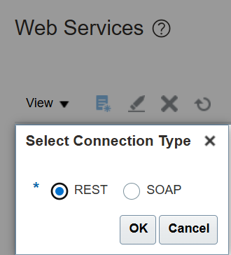

# Validate Access to a Given Invoice Number for the Current User Using Fusion Cloud REST API

## Introduction

For a given invoice, let us validate if the current user has access to the object. Only then corresponding managed attachments of the object will be shown to the user.

**Estimated Lab Time**: *20 minutes*

### Objectives

In this lab, you will

- Create Invoice Access Webservice in Fusion Apps
- Create a global function to validate a given Invoice number in Fusion Apps

### Prerequisites

This lab assumes you have:

- A Paid or LiveLabs Oracle Cloud account
- Access to an Oracle Fusion Applications instance with integrated Oracle Visual Builder Cloud Service.
- All previous labs successfully completed

## Task 1: Create Invoice Access Webservice

This webservice will return the invoice based on the given invoice number if the current user has access to the invoice.

1. To enter the **Application Composer** where you'll be making your WebCenter Content integration changes, click **Tools** in the upper left corner of the page and then select **Application Composer** from the drop-down list.

   

2. Choose **Common Setup** and then **Web Services** from the left navigation menu.

   

   

3. On the **Web Services** page, click the **Create a new Web Service** icon.

   

4. In the **Select Connection Type** dialog, select the **REST** option and click **OK**.

   

5. On the **Create REST Web Services Connection** page, complete the following fields:

   a.  Name - InvoiceWebservice

   b.  URL - **https://{faHost}/fscmRestApi/resources/11.13.18.05/invoices?q=InvoiceNumber=##InvoiceNumber##**

   c.  Authentication Scheme - Propagate user identity using SAML over SSL

6. In **Select and configure Methods against the Resource** field:

   a. Select **GET**.

   b. Request Payload - Choose Schema URL.

   c. Response Payload - Choose Code Sample and enter value as **{}**.

   

7. Click **Save and Close**.

**Note**  
Currently, this is the Fusion Apps Cloud REST API version - 11.13.18.05. Please choose the appropriate version as per your environment.

## Task 2: Create a Global Function to Validate an Invoice number

This global function calls **InvoiceWebservice** to check if the current user has access to the invoice object.

1. Sign in to Oracle Fusion Apps as an administrator.

2. Choose **Common Setup** and then **Global Functions** from the left navigation menu.

   

3. On the **Global Functions** page, click the **Add a Global Function** icon.

   

4. On the **Create Global Function** page, complete the following fields:

    - In the **Function Name** field, specify **InvoiceValidate** as the name of the function.

    - Select **void** from the **Returns** drop-down list.

5. In the **Parameters** section, click the **Add Parameter** icon, and add the following fields:

   a. Name - **InvoiceNumber**

   b. Type - **String**

6. Download the [validate invoice](files/validate-invoice.groovy) groovy code.

7. In the Edit Script field, paste the contents of the script.

8. Click **Save and Close**.

   

This function will be called in a subsequent lab. You may proceed to the next lab.

## Acknowledgements

- **Authors-** Ratheesh Pai, Senior Principal Member Technical Staff, Oracle WebCenter Content
- **Contributors-** Ratheesh Pai, Rajiv Malhotra, Vinay Kumar
- **Last Updated By/Date-** Ratheesh Pai, June 2025
